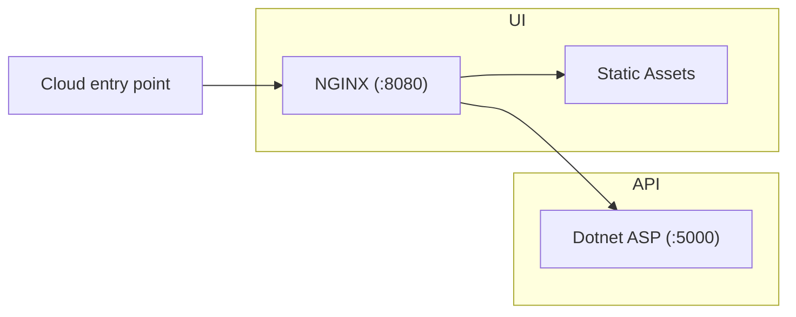

# dotnet-container

The goals of this project are:

- Build a simple containerised web project backed by a dotnet API.
- Include CI for publishing to the Github container registry.
- Refresh + demonstrate best practices for containerisation/CI.
- Simple launchpad codebase for future full-stack projects.
- Positive developer experience for both development and production workflows.

## Prerequisites (Windows WSL)

- [Install WSL](https://learn.microsoft.com/en-us/windows/wsl/install)
  - `wsl --install` (in an administrator command prompt)
- [Ensure docker is set up with WSL](https://docs.docker.com/desktop/wsl/)
- [Install the dotnet SDK v8.0 in WSL](https://learn.microsoft.com/en-us/dotnet/core/install/linux-ubuntu)
  - `sudo apt-get update && sudo apt-get install -y dotnet-sdk-8.0`

## Quick start

```bash
cp ./ui/.env.example ./ui/.env
PROJECT=${PWD##*/} docker compose up --build
```

[View UI](http://localhost:8081/) - [View API](http://localhost:8081/api/) - [View Swagger](http://localhost:8081/api/swagger)

For many of the commands in the project, we rely on having a project name configured to name containers, packages etc. We use `${PWD##*/}` for this to grab the current directory name, but you can name it however you prefer.

## Project Structure



This project does not define much infrastructure by design, and instead provides a minimal set of preconfigured tools. This enables you to extend in the future depending on your project's needs. For example, you might want to:

- Serve static files from S3 instead of from the UI container.
- Replace the front-end NGINX server with a node SSR framework like Next.
- Retain the front-end and use a different technology for the backend.
- Add additional backend servers, or a database.

The following workflows are generally supported:

- Running in a development configuration directly on your machine, without docker as an intermediate layer.
- Packaging in a release configuration as docker containers.

The capability for running locally within docker is also included (e.g. via `docker compose`) so that the integration can be checked in a production-like environment.

## API

The API binds to the port `5000` for HTTP requests. The API does not expose an HTTPS endpoint. It is assumed the API server will not be directly exposed to the network, and instead traffic will instead be routed through the UI container.

### Running locally

```bash
dotnet build api
dotnet run --project api
```

[View API](http://localhost:5000) - [View Swagger](http://localhost:5000/swagger/)

### Running in Docker

```bash
docker build -t ${PWD##*/}-api:dev ./api
docker run --rm --name api -p 5000:5000 ${PWD##*/}-api:dev
```

[View API](http://localhost:5000)

## UI

The UI binds to the following ports:

- `:8081` for HTTP in production (when running in a container).
- `:5002` for HTTP in development (when running locally).

The UI expects to be able to find the API at the following location:

- `http://api:5000/` in production (when running in a container).
- `http://localhost` in development (when running locally).

To keep the project as flexible as possible, the UI only has 2 `npm` development dependencies:

- `typescript` for checking TypeScript code.
- `esbuild` for bundling.

### Running locally

For development builds:

- The UI is bundled by `esbuild`
- A node server is configured to allow:
  - Access to the bundled files.
  - Proxied access to the API (under `/api/`).

```bash
npm --prefix ui run dev
```

[View UI](http://localhost:8081/)

[NVM](https://github.com/nvm-sh/nvm) is recommended for managing node versions - see `.nvmrc`.

### Running in Docker

For production builds:

- The UI is bundled by `esbuild` and included in the container.
- An NGINX server is configured to allow:
  - Access to the bundled files.
  - Proxied access to the API (under `/api/`).

The following commands would start the UI in isolation, however by default NGINX cannot reach the backend at `http://api:80/` (unless started within `docker-compose`).

```bash
docker build -t ${PWD##*/}-ui:dev ./ui
docker run --rm --env-file ./ui/.env --name ui -p 8081:8080 ${PWD##*/}-ui:dev
```

You will need to use a docker network to connect them together and perform similar port mappings yourself:

```bash
docker network create dotnet-container
docker run --rm --network dotnet-container --name api -p 5000:80 ${PWD##*/}-api:dev
docker run --rm --network dotnet-container --env-file ./ui/.env --name ui -p 8081:8080 ${PWD##*/}-ui:dev
```

[View UI](http://localhost:8081)

## Environment variables

To support running via docker or a cloud host, there are a number of environment variables available within this project that can be configured at run-time.

To populate an initial set of environment variables, you can copy the `./ui/.env.example` file. Many of the docker commands in this `README` assume environment vairables can be loaded from `./ui/.env`.

```bash
cp ./ui/.env.example ./ui/.env
```

The following environment variables are currently configured:

- `./ui/.env`
  - `API_HOST` - The location (host name) of the API, used by NGINX for proxying.
  - `API_PORT` - The location (port) of the API, used by NGINX for proxying.
  - `API_PATH` - The path for requests to the API, used by NGINX for proxying.

## References

- [Dotnet console docker sample](https://github.com/dotnet/dotnet-docker/blob/main/samples/dotnetapp/README.md)
- [Dotnet asp docker sample](https://github.com/dotnet/dotnet-docker/blob/main/samples/aspnetapp/README.md)
- [Dotnet CLI project creation](https://learn.microsoft.com/en-us/dotnet/core/tools/dotnet-new)
- [Containerizing dotnet](https://chris-ayers.com/2023/12/03/containerizing-dotnet-part-1)
- [Publishing to Github packages](https://docs.github.com/en/actions/publishing-packages/publishing-docker-images)
- [Serve Static Files with Nginx and Docker](https://sabe.io/tutorials/serve-static-files-nginx-docker)
- [ESBuild dev proxy](https://esbuild.github.io/api/#serve-proxy)
- [NGINX environment variable templating](https://hub.docker.com/_/nginx/)

## TODO

- Certificates for SSL.
  - https://letsencrypt.org/docs/certificates-for-localhost/
  - https://phoenixnap.com/kb/letsencrypt-docker
- Deployment steps for AWS (lightsail or other).
  - https://docs.aws.amazon.com/lightsail/latest/userguide/amazon-lightsail-container-services-deployments.html#creating-deployments-public-endpoint
  - docker pull ghcr.io/bencoveney/dotnet-container-ui:main
  - docker pull ghcr.io/bencoveney/dotnet-container-api:main
- Think about logs, database.
- Add cache busting and/or `/info` path - integrate git hash somehow.
