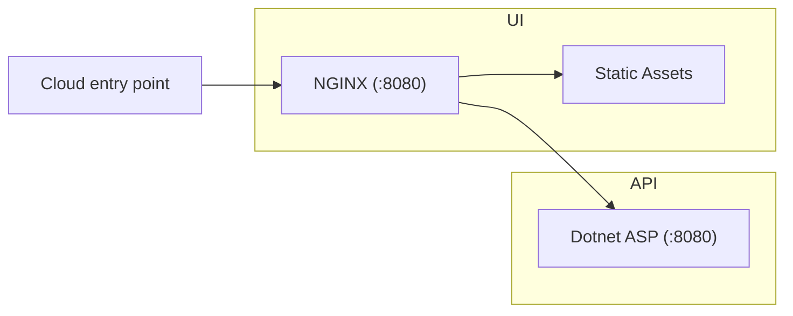

# dotnet-container

The goals of this project are:

- Build a simple containerised web project backed by a dotnet API.
- Include CI for publishing to the Github container registry.
- Refresh + demonstrate best practices for containerisation/CI.
- Simple launchpad codebase for future full-stack projects.

## Prerequisites (Windows WSL)

- [Install WSL](https://learn.microsoft.com/en-us/windows/wsl/install)
- [Ensure docker is set up with WSL](https://docs.docker.com/desktop/wsl/)
- [Install dotnet in WSL](https://learn.microsoft.com/en-us/dotnet/core/install/linux-ubuntu)

## Quick start

```bash
$ PROJECT=${PWD##*/} docker compose up --build
```

## Project Structure



## API

### Running locally

```bash
$ dotnet build api
$ dotnet run --project api
```

[View output](http://localhost:5112)
[Swagger](http://localhost:5112/swagger/)

### Running in Docker

```bash
$ docker build -t ${PWD##*/}-api:dev ./api
$ docker run --name api -p 8080:8080 ${PWD##*/}-api:dev
```

[View output](http://localhost:8080)

## UI

### Running locally

```bash
$ npx http-server ./ui/static/ -p 8081
```

[View output](http://localhost:8081/)

### Running in Docker

```bash
$ docker build -t ${PWD##*/}-ui:dev ./ui
$ docker run --name ui -p 8081:8081 ${PWD##*/}-ui:dev
```

[View output](http://localhost:8081)

## Clean

```bash
$ dotnet clean api
$ dotnet nuget locals all --clear
$ docker system prune --volumes -a -f
```

## References

- [Dotnet console docker sample](https://github.com/dotnet/dotnet-docker/blob/main/samples/dotnetapp/README.md)
- [Dotnet asp docker sample](https://github.com/dotnet/dotnet-docker/blob/main/samples/aspnetapp/README.md)
- [Dotnet CLI project creation](https://learn.microsoft.com/en-us/dotnet/core/tools/dotnet-new)
- [Containerizing dotnet](https://chris-ayers.com/2023/12/03/containerizing-dotnet-part-1)
- [Publishing to Github packages](https://docs.github.com/en/actions/publishing-packages/publishing-docker-images)
- [Serve Static Files with Nginx and Docker](https://sabe.io/tutorials/serve-static-files-nginx-docker)

## TODO

- `http-server` proxy configuration.
- `esbuild` build for UI.
- `env` file for port configuration etc, to support deployment.
- Certificates for SSL.
- Deployment steps for AWS (lightsail or other).
- Maybe write/diagram some choices made.
