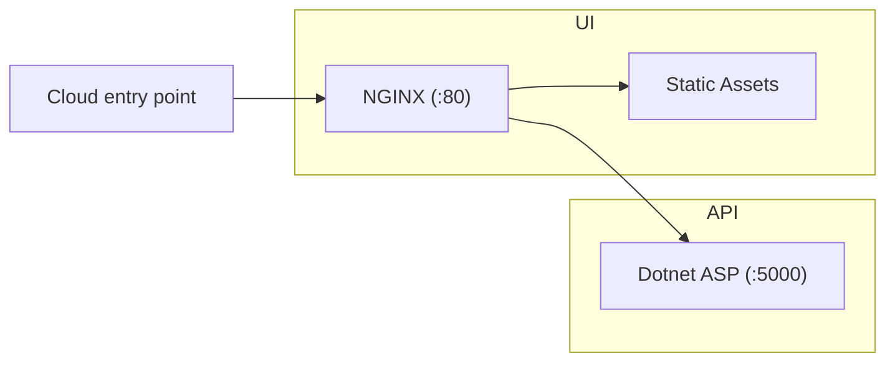

# dotnet-container

The goals of this project are:

- Build a simple containerised web project backed by a dotnet API.
- Include CI for publishing to the Github container registry.
- Refresh + demonstrate best practices for containerisation/CI.
- Simple launchpad codebase for future full-stack projects.
- Positive developer experience for both development and production workflows.

## Prerequisites (Windows WSL)

- [Install WSL](https://learn.microsoft.com/en-us/windows/wsl/install)
  - `wsl --install` (in an administrator command prompt)
- [Ensure docker is set up with WSL](https://docs.docker.com/desktop/wsl/)
- [Install the dotnet SDK v8.0 in WSL](https://learn.microsoft.com/en-us/dotnet/core/install/linux-ubuntu)
  - `sudo apt-get update && sudo apt-get install -y dotnet-sdk-8.0`

## Quick start

```bash
cp ./ui/.env.example ./ui/.env
docker compose up --build
```

[View UI](http://localhost/) - [View Swagger](http://localhost/api/swagger)

## Project Structure



This project does not define much infrastructure by design, and instead provides a minimal set of preconfigured tools. This enables you to extend in the future depending on your project's needs. For example, you might want to:

- Serve static files from S3 instead of from the UI container.
- Replace the front-end NGINX server with a node SSR framework like Next.
- Retain the front-end and use a different technology for the backend.
- Add additional backend servers, or a database.

The following workflows are generally supported:

- Running in a development configuration directly on your machine, without docker as an intermediate layer.
- Packaging in a release configuration as docker containers.

The capability for running locally within docker is also included (e.g. via `docker compose`) so that the integration can be checked in a production-like environment.

## API

The API binds to the port `5000` for HTTP requests. The API does not expose an HTTPS endpoint. It is assumed the API server will not be directly exposed to the network, and instead traffic will instead be routed through the UI container.

### Running locally

```bash
dotnet build api
dotnet run --project api
```

[View API](http://localhost:5000) - [View Swagger](http://localhost:5000/swagger/)

### Running in Docker

```bash
docker build -t ${PWD##*/}-api:dev ./api
docker run --rm --name api -p 5000:5000 ${PWD##*/}-api:dev
```

[View API](http://localhost:5000)

## UI

The UI binds to the following ports:

- `:80` for HTTP in production (when running in a container).
- `:5001` for HTTP or `:5002` for HTTPS in development (when running locally).

The UI expects to be able to find the API at the following location:

- `http://api:5000/` in production (when running in a container), configurable via environment variables.
- `http://localhost:5000` in development (when running locally).

To keep the project as flexible as possible, the UI only has 2 `npm` development dependencies:

- `typescript` for checking TypeScript code.
- `esbuild` for bundling.

### Running locally

For development builds:

- The UI is bundled by `esbuild`
- A node server is configured to allow:
  - Access to the bundled files.
  - Proxied access to the API (under `/api/`).

```bash
npm --prefix ui run dev
```

[View HTTP UI](http://localhost:5001/) - [View HTTPS UI](http://localhost:5002/)

[NVM](https://github.com/nvm-sh/nvm) is recommended for managing node versions - see `.nvmrc`.

#### HTTPS and SSL Certificates

To install a dev certificate valid for `https://localhost` (for 365 days) you can run `dev-certs.sh` to generate SSL certificates. These will be stored under `./certs` and will need to be installed on your machine. The script output contains WSL installation instructions. You may need to restart your browser for the new root certificate to be picked up.

This dev certificate will only be used when running a development build locally. The container build serves traffic as HTTP rather than HTTPS, to allow the certificate to be configured by the cloud provider.

### Running in Docker

For production builds:

- The UI is bundled by `esbuild` and included in the container.
- An NGINX server is configured to allow:
  - Access to the bundled files.
  - Proxied access to the API (under `/api/`).

The following commands would start the UI in isolation, however by default NGINX cannot reach the backend at `http://api:80/` (unless started within `docker-compose`).

```bash
docker build -t ${PWD##*/}-ui:dev ./ui
docker run --rm --env-file ./ui/.env --name ui -p 80:80 ${PWD##*/}-ui:dev
```

You will need to use a docker network to connect them together and perform similar port mappings yourself:

```bash
docker network create dotnet-container
docker run --rm --network dotnet-container --name api -p 5000:80 ${PWD##*/}-api:dev
docker run --rm --network dotnet-container --env-file ./ui/.env --name ui -p 80:80 ${PWD##*/}-ui:dev
```

[View UI](http://localhost)

## Environment variables

To support running via docker or a cloud host, there are a number of environment variables available within this project that can be configured at run-time.

To populate an initial set of environment variables, you can copy the `./ui/.env.example` file. Many of the docker commands in this `README` assume environment vairables can be loaded from `./ui/.env`.

```bash
cp ./ui/.env.example ./ui/.env
```

The following environment variables are currently configured:

- `./ui/.env`
  - `API_PROTOCOL` - The protocol for reaching the API, used by NGINX for proxying.
  - `API_HOST` - The location (host name) of the API, used by NGINX for proxying.
  - `API_PORT` - The location (port) of the API, used by NGINX for proxying.
  - `API_PATH` - The path for requests to the API, used by NGINX for proxying.

## Healtcheck

Both the API and UI expose a `/healthcheck` endpoint which can be used to validate that they are working correctly.

[UI Healthcheck](http://localhost/healthcheck) - [API Healthcheck](http://localhost/api/healthcheck)

## Deployment

This project aims not to be too coupled to any one cloud provider or host, to allow flexibility depending on your project's needs. With that being said, it can be useful to give an idea for how to get the app up and running somewhere, to give an understanding of what is involved.

Generally you need to do the following:

- Ensure the container packages can be accessed by the cloud provider. This example deploys the containers built by the Github Actions pipelines, hosted in the Github Container Registry. If you will be doing the same, you may need to set the packages visibility to public, to ensure Lightsail can access them.
- Configure the API container to allow HTTP connections on port `5000` from the UI container. You will likely want to avoid exposing this port externally.
- Configure the UI container to allow HTTP connections on port `80`.
- Configure the UI container's environment variables, so that it knows how to route `/api/` requests to the API container.
- Configure an externally facing load balancer (depending on your cloud provider) to provide the SSL certificates and connection to the external internet.

### Deploy to AWS Lightsail

[AWS Lightsail](https://aws.amazon.com/lightsail/) is a low cost/complexity platform that includes 3 months of credit in the AWS Free Tier at the time of writing.

As we will be deploying multiple pre-built containers, we will need to create a "container service" within Lightsail. These are the values you'll need to configure:

- Location: Up to you, I chose `eu-west-2`
- Container Service Capacity: `Micro` power and `x1` scale for AWS Free Tier
- Deployment: `Specify a custom deployment`
  - 1st Container:
    - Name: `api`
    - Image: `ghcr.io/bencoveney/dotnet-container-api:sha-ae98b7e` - _Update to point to your registry/container._
    - Open Ports:
      - `5000`: `HTTP`
  - 2nd Container:
    - Name: `ui`
    - Image: `ghcr.io/bencoveney/dotnet-container-ui:sha-ae98b7e` - _Update to point to your registry/container._
    - Environment Variable Values:
      - `API_PROTOCOL`: `http`
      - `API_HOST`: `localhost`
      - `API_PORT`: `5000`
      - `API_PATH`: `/api/`
    - Open Ports:
      - `80` - `HTTP`
  - Public endpoint: - Container: `ui` - Port: `80` - Health check path: `/` or `/healthcheck`
    Identify your service: `container-service-1` - _This can be whatever you want._

A sample deployed application can be found here: [UI](https://container-service-1.19iaj1mj95gdk.eu-west-2.cs.amazonlightsail.com/) - [UI Healthcheck](https://container-service-1.19iaj1mj95gdk.eu-west-2.cs.amazonlightsail.com/healthcheck) - [API Healthcheck](https://container-service-1.19iaj1mj95gdk.eu-west-2.cs.amazonlightsail.com/api/healthcheck)

## References

- [Dotnet console docker sample](https://github.com/dotnet/dotnet-docker/blob/main/samples/dotnetapp/README.md)
- [Dotnet asp docker sample](https://github.com/dotnet/dotnet-docker/blob/main/samples/aspnetapp/README.md)
- [Dotnet CLI project creation](https://learn.microsoft.com/en-us/dotnet/core/tools/dotnet-new)
- [Containerizing dotnet](https://chris-ayers.com/2023/12/03/containerizing-dotnet-part-1)
- [Publishing to Github packages](https://docs.github.com/en/actions/publishing-packages/publishing-docker-images)
- [Serve Static Files with Nginx and Docker](https://sabe.io/tutorials/serve-static-files-nginx-docker)
- [ESBuild dev proxy](https://esbuild.github.io/api/#serve-proxy)
- [NGINX environment variable templating](https://hub.docker.com/_/nginx/)
- [LetsEncrypt localhost certificate](https://letsencrypt.org/docs/certificates-for-localhost/)

## Future Ideas:

- Documentation covering CI pipelines.
- Simplify environment variables
  - `API_PATH` probably isn't required.
  - `API_PROTOCOL` probably isn't required.
  - `API_HOST` and `API_PORT` can probably be consolidated
- Add a database (container, cloud deployment plan incl. migrations etc).
- Add cache busting.
- Add an `/info` endpoint or extend the healthcheck.
- Extend the app with some simple functionality to demonstrate the end-to-end functionality.
