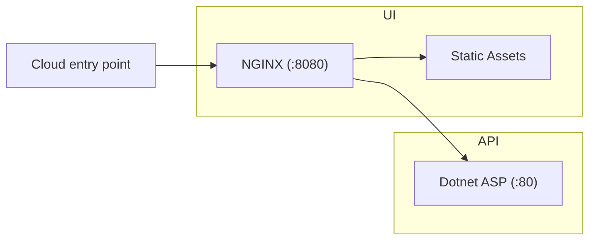

# dotnet-container

The goals of this project are:

- Build a simple containerised web project backed by a dotnet API.
- Include CI for publishing to the Github container registry.
- Refresh + demonstrate best practices for containerisation/CI.
- Simple launchpad codebase for future full-stack projects.
- Positive developer experience for both development and production workflows.

## Prerequisites (Windows WSL)

- [Install WSL](https://learn.microsoft.com/en-us/windows/wsl/install)
  - `wsl --install` (in an administrator command prompt)
- [Ensure docker is set up with WSL](https://docs.docker.com/desktop/wsl/)
- [Install the dotnet SDK v8.0 in WSL](https://learn.microsoft.com/en-us/dotnet/core/install/linux-ubuntu)
  - `sudo apt-get update && sudo apt-get install -y dotnet-sdk-8.0`

## Quick start

```bash
$ PROJECT=${PWD##*/} docker compose up --build
```

[View UI](http://localhost:8081/) - [View API](http://localhost:8081/api/)

Note: For many of the commands in the project, we rely on having a project name configured to name containers, packages etc. We use `${PWD##*/}` for this to grab the current directory name, but you can name it however you prefer.

## Project Structure



## API

The API binds to the following ports:

- `:80` for HTTP in production (exposed by the container).
- `:5000` for HTTP in development.

The API does not expose an HTTPS endpoint. It is assumed the API server will not be directly exposed to the network, and instead traffic will instead be routed through the UI container.

### Running locally

```bash
$ dotnet build api
$ dotnet run --project api
```

[View API](http://localhost:5000) - [View Swagger](http://localhost:5000/swagger/)

### Running in Docker

```bash
$ docker build -t ${PWD##*/}-api:dev ./api
$ docker run --name api -p 5000:80 ${PWD##*/}-api:dev
```

[View API](http://localhost:5000)

## UI

The UI binds to the following ports:

- `:8081` for HTTP in production.
- `:8081` for HTTP in development.

### Running locally

```bash
$ npx http-server ./ui/static/ -p 8081
```

[View UI](http://localhost:8081/)

### Running in Docker

For production builds:

- The UI is bundled as static files and included in the container.
- An NGINX server is configured to allow:
  - Access to the bundled files.
  - Proxied access to the API.

```bash
$ docker build -t ${PWD##*/}-ui:dev ./ui
$ docker run --name ui -p 8081:8081 ${PWD##*/}-ui:dev
```

[View UI](http://localhost:8081)

## Extending

This project does not define much infrastructure by design, and instead provides a minimal set of preconfigured tools.

You may wish to extend in the future depending on your project's needs. For example, you might want to:

- Serve static files from S3 instead of from the UI container.
- Replace the front-end NGINX server with a node SSR framework like Next.
- Add additional backend servers, or a database.

## References

- [Dotnet console docker sample](https://github.com/dotnet/dotnet-docker/blob/main/samples/dotnetapp/README.md)
- [Dotnet asp docker sample](https://github.com/dotnet/dotnet-docker/blob/main/samples/aspnetapp/README.md)
- [Dotnet CLI project creation](https://learn.microsoft.com/en-us/dotnet/core/tools/dotnet-new)
- [Containerizing dotnet](https://chris-ayers.com/2023/12/03/containerizing-dotnet-part-1)
- [Publishing to Github packages](https://docs.github.com/en/actions/publishing-packages/publishing-docker-images)
- [Serve Static Files with Nginx and Docker](https://sabe.io/tutorials/serve-static-files-nginx-docker)

## TODO

- Proxy configuration for UI - Need dev mode + NGINX config. NGINX currently references `docker compose` hosts.
- `esbuild` build for UI.
- `env` file for port configuration etc, to support deployment.
- Certificates for SSL.
  - https://letsencrypt.org/docs/certificates-for-localhost/
  - https://phoenixnap.com/kb/letsencrypt-docker
- Deployment steps for AWS (lightsail or other).
- Maybe write/diagram some choices made.
- Pin node version.
- Think about logs, database.
